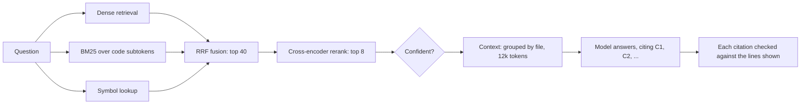

# cqa

Question answering over a Git repository using RAG, with every claim cited to the exact
lines that support it (`path:start-end`) and supporting abstention.

To be implemented...
- Evaluation harness that measures retrieval and answers separately, providing a number and confidence interval
- Multiple chunk retrieval strategies with a rank merge and re-ranking. (BM25, symbol table look-up)
- Agent loop implementation, comparing multi-step reasoning cost and time to one step retrieval

Future implementations...
- Re-index only on changed files.

> **Status: in development.** Base implementation — simple chunking and retrieval.

## How it works

First, we need to ingest the repo at a specific commit, creating indexes that we retrieve chunks from. 

The final implementation follows this structure.


An indexer turns a repository at a pinned commit into syntax-aware chunks,
vectors, a BM25 index over code subtokens, and symbol tables. The query
pipeline retrieves three ways, fuses and reranks the results, and has the model
cite short excerpt labels, which the server maps back to exact lines and
checks. The evaluation harness drives the same code path the API serves, so it
measures exactly what users get.

## Design choices

#### Chunking
Chunking by syntax unit (AST) saves code structures and definitions. Handling for non-function code allows full coverage. Splitting and packing after initial chunking with tagged information keeps chunk size uniform.

#### Retrieval Pipeline
We use three main ways to retrieve chunks given a query.

Storing chunks as embeddings allows for nearest neighbor algorithms to get chunks that are semantically similar.
- Approximate nearest neighbor (ANN) algorithms such as an inverted file (IVF) index can make this faster

Lexical retrieval matches exact terms. This is important in code, where different names, which can be similar, mean different things.
- BM25 algorithm utilizes an interved index to reduce search space and handles scoring across variable sized chunks and weighing across where the terms match (chunks hold label and body fields)

Symbol lookup utilizes actual code structure. In code, names and functions do not have to semantically similar or have the same terms to be related.

We merge with RRF, which prioritizes existence in multiple methods.
- $\text{RRF}(d)=\sum_r \dfrac{w_r}{k+\text{rank}_r(d)}$

Finally, a cross-encoder runs against the set of candidate chunks with full attention on the question and code together. 

#### Answer generation
Citations are crucial to answer generation and measuring the quality of evidence, allowing us to check if cited lines actually support answers. 

Abstention is prioritized over hallucination.

## Evaluation

**Questions:** Six categories: locate,
  explain, impact, enumerate, flow, and 20 unanswerable. 

**Contamination**: Public repos that the chosen LLM may have trained on or has outside knowledge of can artificially increase accuracy. 

## Getting started

Requires Python 3.11 or later and git.

```bash
python -m venv .venv && source .venv/bin/activate
pip install -e ".[llm,local,dev]"
cp .env.example .env        # then set ANTHROPIC_API_KEY
set -a && . ./.env && set +a   # export the settings into the shell
make check                  # lint, type-check, and test
```

Settings are read from the environment; nothing loads `.env` automatically.

Optional extras: `voyage` for hosted embeddings, `hnsw` for the hnswlib vector
store, and `serve` for the HTTP API.

```bash
cqa index <repository path or URL> --commit <sha>
cqa ask "Where is the session token validated?" --repo <repository path or URL>
cqa eval run --config configs/base.yaml --hypothesis "baseline" --arms real,oracle,closed_book
cqa eval compare <run-a> <run-b>
cqa serve
```

## Configuration

| File | Purpose |
| --- | --- |
| `configs/base.yaml` | The best pipeline configuration measured so far |
| `configs/design.yaml` | The full design, for comparison |
| `configs/exp/` | One file per experiment, each changing one thing |
| `configs/eval.yaml` | Evaluation settings: coverage threshold, budgets, judge, smoke subset |
| `configs/prices.yaml` | Dated model prices for cost accounting |
| `.env.example` | Secrets and deployment settings, read from the environment |

Configuration files are strict: an unknown key is an error, not a silent
default. `cqa config <file>` prints the merged configuration and its hash.

## Development

`make check` runs `ruff check`, `ruff format --check`, `mypy` in strict mode,
and `pytest`, as CI does. While the package is under construction, a test that
reaches an unimplemented function is reported as skipped rather than failed;
`pytest -rs` lists each one with the function it is waiting on.

## Repository layout

| Path | Contents |
| --- | --- |
| `cqa/` | The package: `ingest`, `chunking`, `embed`, `index`, `retrieve`, and `generate`, plus `agent`, `eval`, and `serve` |
| `configs/` | Pipeline, experiment, evaluation, and price configuration |
| `evalsets/` | The pinned repositories, labeled questions, and judge calibration labels |
| `docs/` | Architecture, decision records, and the experiment log |
| `scripts/` | The vector store benchmark |
| `tests/` | Unit tests on hand-worked cases, and a toy repository fixture |
| `web/` | The browser client's API contract |
